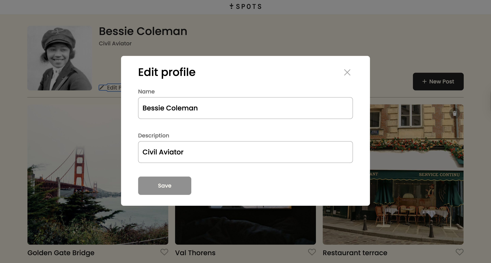
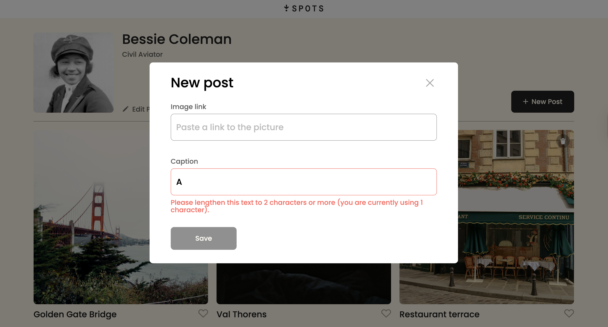

# Spots — Interactive Image Sharing App

## Description

Spots is an interactive image-sharing web application that allows users to manage a personal profile and interact with image posts through a modern, responsive interface.

The project began as a frontend UI and evolved into a fully connected application using a real backend API. The application now supports persistent user data, card creation, likes, and deletion with confirmation workflows.

The main focus areas of this project include:

- Responsive design across desktop, tablet, and mobile devices
- Modular JavaScript architecture
- REST API integration
- Dynamic modal-based user interactions
- Form validation and UX feedback improvements

---

## Features

### User Profile

- Load profile data from server
- Edit name and description
- Update profile avatar (persistent)

### Image Cards

- Load cards from API on page load
- Add new cards (saved to server)
- Delete cards (with confirmation modal + server sync)
- Like / Unlike cards (server persisted)

### Modal System

- Edit Profile Modal
- Add Post Modal
- Avatar Update Modal
- Delete Confirmation Modal
- Image Preview Modal

### Form UX

- Real-time validation
- Disabled submit buttons when invalid
- Loading states (Saving…, Deleting…, etc.)
- Form reset on modal close

### Responsive Design

- Built with media queries
- Mobile-friendly modal layouts
- Figma-aligned delete modal styling

---

## Tech Stack

### Core

- HTML5
- CSS3
- JavaScript (ES6 Modules)

### Architecture / Patterns

- BEM Methodology
- Modular File Structure
- Reusable Modal Utility Functions
- Centralized API Class

### Tooling

- Webpack
- Babel
- Core-JS
- Regenerator Runtime

### Backend Integration

REST API via Fetch:

- GET /users/me
- PATCH /users/me
- PATCH /users/me/avatar
- GET /cards
- POST /cards
- DELETE /cards/:cardId
- PUT /cards/:cardId/likes
- DELETE /cards/:cardId/likes

---

## Project Pitch Video

Check out this video where I walk through the project, explain the tools used, challenges I faced, and how I solved them:

[Project Pitch – Final Submission](https://drive.google.com/file/d/1sPFKhY2srehYVtdlWmutXIR1k7cQPGDE/view?usp=sharing)

---

## Additional Project Videos

Check out these videos documenting earlier stages of the project:

- [Initial Walkthrough](https://drive.google.com/file/d/1p7uL5EHT-B_8yJi0w1TI8TphUUkG1mY3/view?usp=sharing)
- [Project Update – 8/29/25](https://drive.google.com/file/d/1ddO4qqPIQT6orj96ogNDikqFgfn4SqxP/view?usp=sharing)

---

## Deployment

Live Site:  
https://chrisdiaz98.github.io/se_project_spots

---

## What I Learned

This project helped me develop a deeper understanding of:

- Connecting frontend apps to real backend APIs
- Managing async data with Promises and Promise.all
- Designing scalable modal and validation systems
- Mapping DOM elements to server data safely
- Writing clean modular JavaScript
- Improving UX with loading states and validation feedback

---

## Future Improvements

Planned enhancements include:

- Like counters displayed on cards
- Delete permissions restricted to card owner
- OOP refactor using classes (Popup, Card, Section, UserInfo)
- Skeleton loading states
- Accessibility improvements

---

## Screenshots

